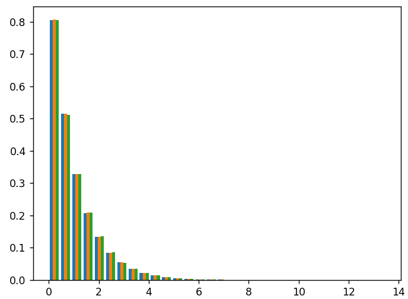

# How PoW Works

In the previous section, we explained what PoW _does_. In this segment, we dive into the details of how it _works_. This section also marks our first encounter with math. The level of formality will steadily increase as we make our presentation more precise. If you find math unsavory, the descriptive parts alone should be enough to take you through the other descriptive parts throughout the book. Even if you do have some math mileage under your belt, be sure to read deliberately and let the details sink in. If you desire to understand the mathematics underlying the descriptive discussions to follow, they are essential.

You might have heard that PoW works by posing the miners with "complex mathematical puzzles". I argue that these mathematical puzzles are not "complex" at all. In fact, they are _designed_ to be _incredibly dumb_: there is no better way to solve them than banging your head against them by trying out all possible solutions in no particular order until you find one that works. It takes _exceptional cleverness_ to design a puzzle this dumb. A game so impossible to strategise that the dumbest and smartest players have exactly the same odds.

When constructing a dumb puzzle, there is a tunable parameter called the _difficulty target_ that adjusts how hard the puzzle is. By correctly adjusting the difficulty target, we determine how long we should expect to wait before a solution emerges. In this section, we assume that the correct difficulty target is given to us by divine inspiration. In the next segment, we explain how Bitcoin adjusts the difficulty target in practice.

<div align="right"><figure><figcaption><p>My gratitude to <a href="https://qu.ai/">Quai network</a> for<br>sponsoring this segment of the book</p></figcaption></figure></div>

## Hashes as Random Oracles

The cryptographic building block of PoW is something called a _cryptographic hash function_ (CH). Even those of you who have never heard about CHs can name some that are used in practice. This includes  the $$\textsf{SHA-256}$$ hash used in Bitcoin, and many other hashes you might have heard of, such as $$\textsf{Keccak}$$, $$\textsf{Blake}$$, $$\textsf{Ethash}$$, and $$\textsf{Scrypt}$$.

Each of these hash functions is a universe within itself, packing many clever ideas. But they all have the same goal: to appear _random_ on previously untested inputs. Let us choose an arbitrary CH and denote it $$\textsf{H}$$. The property that a CH is trying to emulate is that it is impossible to _predict_ the outcome of $$\textsf{H}$$. We will carefully define what that means in a moment.

In cryptography, we like to have neat formalism to streamline a division of labor. We do so by assuming we have an _ideal_ $$\textsf{H}$$, and leaving it to others to figure out how to implement $$\textsf{H}$$ in a way that is sufficiently close to our ideal description. Such an ideal hash is called a _random oracle_, and assuming it exists means we are working in something called the _random oracle model_ (ROM).

I provide a more substantial survey of random oracles in [the appendix](../../supplementary-material/computer-science/page-3/random-oracles.md). But for now, all you need to know is that a random oracle is a _magic box_ floating in the sky. Anyone can approach the box and give it any string $$s$$ they want as an input. The box replies with a string of 256 bits we call $$\textsf{H}(s)$$. We call this _querying the oracle on_ $$s$$. We are promised that when the universe was created, the reply for each input was chosen _uniformly_ and _independently_. That is, the value of $$\textsf{H}(s)$$ for each $$s$$ was seleccted at the dawn of time by a series of 256 coin flips.

Random oracles cannot exist in reality. They are too ideal. Hash functions are attempts to provide clever substitutes. Efficient functions that are not really random, but scramble the input so thoroughly that it becomes infeasible to predict the function without a galactic-scale computer.


The reason random oracles can't exist is simply because of storage. A random oracle provides for each possible value of $$s$$ a truly random string $$\textsf{H}(s)$$, of which there are infinitely many.

Even if we limit the length of $$s$$ to say $$100$$ bits (which is _much much smaller_ from what we actually need), we will find that there are $$2^{100}$$ possible inputs, requiring a storage of $$2^{100} \cdot 256$$ bits, which is more than one petabyte _for each star in the universe_.

The crux is that random data is not compressible. If it admits a more compact representation, then it is not truly random. Compression requires strong patterns, which are the opposite of randomness.

Knowing this, I find CHs that much more impressive. Emulating an inherently inefficient phenomenon with fiendishly light and fast circuits, so well that no one has ever managed to distinguish the two, is truly a marvel. How it is actually done, and why we feel comfortable using these "mere" approximations, is a topic for an entirely different book.


A consequence of the independence is that it is hard to find a _preimage_. Given some output $$y$$, there is no better way to find an $$s$$ such that $$\textsf{H}(s)=y$$ then guessing different values of $$s$$ until you find one that works. For any $$s$$, there are $$2^{256}$$  equally likely possibilities for $$\textsf{H}(s)$$. This implies that, on average, finding a correct $$s$$ should take about $$2^{256}$$ attempts. To understand how fantastically large this number is, check out this video:




This form of security is called _preimage resistance_. This is a useful property but in itself, not strong enough to call a function a CH.

There are other important security properties that you might encounter. For example, _collision resistance_: the infeasibility of finding two inputs $$s\ne s'$$ such that $$\mathsf{H}(s) = \mathsf{H}(s')$$. A function that satisfies this is called a _collision-resistant hash_ (CRH).

It turns out that being a CRH is strictly stronger than being preimage resistance. And even that is not strong enough for some applications.

A random oracle satisfies any property we could dream of. But hashes don't always follow suit. Sometimes, hashes are known to deviate from behaving like random oracles in certain scenarios, but are still assumed to be close enough in other scenarios. Interestingly, $$\textsf{SHA-256}$$ is such a function. There are known cryptographic schemes that are provably secure with respect to a random oracle, but break down when this oracle is replaced with $$\textsf{SHA-256}$$. See the exercises for more information.

For that reason, handling hash functions should be done with utmost care. Using a hash function outside its recommended scope, or rolling out home-brewed hashes, can be _very_ dangerous.


To streamline the notation a bit further, we set $$N=2^{256}$$ and think of $$\textsf{H}(s)$$ as a natural number $$0\le n  < N$$. This is just a convenient way to order all possible outcomes. This will allow us to easily specify more general tasks, such as "finding an $$s$$ such that $$\textsf{H}(s) < 42$$".

We need just one more quantity before we can continue. Something that will bridge oracle queries with clock times. We define $$t$$ such that the oracle is queried exactly once per $$t$$ seconds. For example, if the oracle is queried once a minute, we set $$t=60$$. If the oracle is queried ten times a second, we set $$t=0.1$$. In practice, we are more likely to encounter values such as $$t=10^{-80}$$. The value $$t$$ is called the _global hash delay_, and its reciprocal $$1/t$$ is called the _global hash rate_.

Approximating the value of $$t$$ and maintaining it over time is the difficulty adjustment problem that we consider in the next chapter. For now, we assume that $$t$$ is fixed and known. Knowing this $$t$$, we can say things like "the expected _time_ it would take to find $$s$$ is  $$t\cdot  N$$ _seconds_".

## Tuning the Difficulty

We already considered the problem of a preimage of $$y$$. Since the outputs are equally likely, we go ahead and assume that $$y=0$$. The problem can be restated a bit awkwardly as "find $$s$$ such that  $$\textsf{H}(s)  < 1$$".

Why is it useful? Because we can now talk about a more general problem: find $$s$$ such that $$\textsf{H}(s) < T$$.  That is, we don't require a specific output, but one out of $$n$$ specific outputs. (Again, since all outputs are uniformly likely and independent, it does not matter _what_ $$n$$ values are allowed, so we choose $$0,\ldots,n-1$$  out of convenience).

We call $$T$$ the _target_, and our first task is to figure out how to set it. To do that, we work out the expected time to solve the puzzle, and how it is affected by $$T$$.

This is a simple computation. For any $$s$$, there is a one in $$N$$ chance that $$\textsf{H}(s)  = 0$$ and a one in $$N$$ chance that $$\textsf{H}(s)=1$$. Note that it is impossible that $$\textsf{H}(s)  = 0$$ _and_ that $$\textsf{H}  (s)=1$$. In probability theory, two events that cannot happen are called _disjoint_.  A basic property of disjoint events is that the probability that _either_ of them happens is the _sum_ of their probabilities. In other words, the probability that $$\textsf{H}(s)=0$$ _or_ $$\textsf{H}(s)=1$$ is two (= one + one) in $$N$$. So we expect it should take about $$N/2$$ queries, or $$t\cdot  N/2$$ seconds, to find such an $$s$$ such that $$\textsf{H}(s)<2$$.

This argument generalizes directly to show that we expect it would take $$t\cdot N/T$$ seconds to find $$s$$ such  that $$\textsf{H}(s)  <  T$$.

With this insight, we can control how long it would take to solve the puzzle by adjusting  $$T$$. If we want it to be $$\lambda$$ seconds, we need $$t\cdot N/T = \lambda$$. Isolating $$T$$, we arrive at an all important formula:

$$
T = t\cdot N/ \lambda
$$

Let's see an example. Say that the global hashrate is one trillion queries per second. In other words,$$t=10^{12}$$. Say we want a block delay of ten minutes. Since we are working in units of seconds, we set $$\lambda = 600$$ and plug everything into the equation to get

$$
T=10^{-12}\cdot2^{256}/600\approx1.876\times2^{206}\text{.}
$$


You might be concerned that the solution is generally not an integer. This concern is much more valid than most people expect. Yes, rounding is obviously the solution, but how do you ensure different implementations — or even the same implementation running on different architectures — all handle rounding errors _exactly_ the same way? Even a slight incompatibility, including a round-off bug in a future popular CPU, can split the network and cause vicious complications. For that reason, cryptocurrencies apply measures that ensure that roundoff error handling remains uniform and platform-independent.


One peculiarity with the difficulty target is that _lower targets make for harder puzzles_. This makes sense, as hitting a number below one million is harder than hitting a number below one trillion. But we have to be mindful of this when using  $$T$$ as a measure of difficulty.&#x20;

To circumvent this, the _difficulty_ is often defined as the reciprocal of the target, $$\tau = 1/T$$. That way, the hardness of the puzzle _grows_ with $$\tau$$. Unfortunately, the terms "difficulty" and "target" are sometimes used interchangeably. If that's not confusing enough, sometimes when people say "the difficulty" they actually mean $$\log_2\tau$$.  There is a perfectly good reason for that, which I will soon explain.

The best advice I can give is that whenever anyone uses the terms _difficulty_ or _target_ in a context where these details are important, be sure to ask them explicitly what they mean.

## Header Coupling

How do we use the puzzle above to space out Bitcoin blocks?

Requiring a block to contain a solution to the puzzle, an $$s$$ such that $$\textsf{H}(s)<T$$, is not enough. Why? Because there is nothing preventing the miner from using the same solution for several blocks. To solve this, we need the problem to depend on the _block itself_.

For technical reasons I won't get into, we don't actually want to feed entire blocks into the hash function. We need a smaller piece of information that still completely defines the block. This piece of information is called the _block header_. The header contains all sorts of metadata about the block. Importantly, it contains a pointer to the previous block (so whenever the chain progresses, the header necessarily channge), and some magic trick called a _Merkle transaction root_ which is much smaller than the content of the block, but is cleverly built such that you can't change the content of the block without changing the transaction root. Even though the header does not _contain_ the transactions, it is _committed to them_. It is impossible to find a _different_ set of transactions with _the same_ Merkle root. We explain how this magic works in [an appendix](../../supplementary-material/computer-science/page-3/merkle-trees.md).

To accommodate the "dumb puzzle", another field called the _nonce_ is added. Importantly, the nonce field can be set to _anything_. To make our lives easy, we will use $$B[n]$$ to denote the header of the block $$B$$  when the nonce is set to $$n$$. And here is the crux: instead  an $$s$$ such that $$\textsf{H}(s)  < T$$, we require the nonce  value $$n$$ to satisfy that $$\textsf{H}(B[n])<T$$. Unlike the string $$s$$, the nonce is _only good for the block_ $$B$$!


The expression $$\textsf{H}(B[n])$$ might cause some distress.  We described query input as "strings", in what sense is the header "a string"? There are many different ways to spell out the header information in a string, and each will yield different results!

The truth is the input is not even general "strings" like English messages, it is _binary_ strings, a list of ones and zeros. So how can $$\textsf{H}(B[n])$$ ever be well defined?

The keyword is _serialization_. Serialization is the process of encoding abstract data in a binary string. There are _many_ ways to serialize data, and the specific serialization doesn't particularly matter. (Some serializations are preferred to others in terms of rooted conventions or particular optimizations, but mathematically, it is all the same.) But it is of utmost importance that everyone use the same serialization. That way, everyone agrees on $$\textsf{H}(B[n])$$.



The nonce field in Bitcoin has a length of $$32$$ bits. When it was defined, it seemed absurd to even imagine that we would ever need a larger space. (ChatGPT estimates the $$\textsf{SHA-256}$$ hashrate of an average CPU in 2010 to be "several millions". You are invited to do the math and see how many CPUs need to be mining to have more  than $$2^{32}$$ hashes per ten minutes.)

However, reality struck, Bitcoin exploded, ASICs hit the mining market, and the hashrate exceeded everyone's expectations by orders of magnitude.

To compensate, Bitcoin miners use several tricks to add more entropy. One popular trick is the "coinbase extrahash". It just means injecting a nonce into the first transaction on the block. This will change the Merkle root tree, hence the hash of the block.

Adding these 32 bits means Bitcoin can now handle hash rates that are $$2^{32}$$ (about 4.3 billion) _times_ larger.


## Isn't Difficulty About Counting Zeros?

...

## The Average Wait Time\*

In a Twitter poll I made, I asked my followers the following question: given that the Bitcoin network produces a block once per ten minutes, if you start waiting for a block at some random time, how long will you wait for the next block on average? These are the results:

<figure><figcaption></figcaption></figure>

It is not surprising that most people will think that the answer is five minutes. After all, if you know that a bus arrives at the stop once every ten minutes then (under the unrealistic assumption that busses arrive on time) if you arrive at the station at a random time, you expect to wait five minutes. (People understand this so deeply on the intuitive level, that they aren't even bothered with the fact that to actually prove this you need to solve an integral).

But block creation _does not_ behave like a bus line. The probability that a nonce is correct is independent of how many nonces you already tried, and the process is _memoryless_.

Imagine rolling a fair day until you roll a 1. How many rolls, on average, should this take? The probability of rolling a 1 in a given try is one in six, and the result of each roll is not affected by whatever happened on previous rolls, so it should take six tries on average.


More generally, if some experiment succeeds with probability $$p$$, it would take an average of $$1/p$$ attempts before the experiment is successful. This is not a trivial fact  (at least, I am not aware of any way to prove it that doesn't require a bit of tricky calculus) yet people seem comfortable accepting it at face value.


Now say that you rolled a die ten times, and annoyingly enough, none of the results were 1. How many _additional_ dice do you expect to roll? Emotionally, we are biased to feel that "I've failed so many times, _what are the chances_ that I fail again?" But, with some clarity, we realize that the die _does not remember_ how may times it was rolled. The expected number of rolls remains six, whether you just started, or failed a million times already.


Mathematically, this can be notated as follows. If $$X$$ is the [random variable](../../supplementary-material/math/probability-theory/random-variables.md) that describes the number of attempts required, then the probability that we need $$n+k$$ attempts given that the first $$k$$ attempts failed is the same, regardless of $$k$$.&#x20;

That is: $$\mathbb{P}[X=n+k\mid X>k] = \mathbb{P}[X=n]$$.


Now all we have to notice is that block creation is no different than rolling dice. More exactly, rolling $$T/N$$-sided dice at a rate of one roll per $$t$$ seconds, until our dice hits $1$. We expect $$N/T$$ attempts to succeed, taking a total of $$t\cdot N/T = \lambda$$ seconds.

So the hard to swallow pill is the following: at _any point in time_ the expected time until the next block is _always_ $$\lambda$$. Yes, even if you have been waiting for a Bitcoin block for twenty minutes now, the average time _remaining_ to wait _remains_ ten minutes.

People have a hard time coming to terms with this, so I took the time to complement the theoretical discussion above with some simulations. I simulated mining in a hash rate of one million blocks per block delay. Sampling a simple block delay like this is very easy: just sample uniformly random numbers between $$0$$ and $$1$$ and count how many attempts it took before you hit a number smaller than $$1/1000000$$. Repeating this process ten thousand times, I obtained a sample of ten thousand block intervals.

I then did the following: I removed all intervals smaller than a minute, and reduced one minute from the remaining intervals. In other words, I removed all miners that waited less than one minute, and adjusted the remaining samples to represent how many _additional_ minutes miners waited. If my claims are correct, and how long you already waited doesn't matter, the new data and old data should distribute _the same_. However, if I am wrong, and _having waited_ does affect _how much longer_ it remains to wait, we will see a difference representing the effect of waiting.

I also repeated the process above, this time for intervals more than _ten minutes_ long.

The results are displayed in the following graph, and we can see quite clearly that the block creation process couldn't care less about how long you already waited:

&#x20;

<figure><figcaption></figcaption></figure>

The code that created this graph is very simple, feel free to experiment with it:

```python
from random import random
import matplotlib.pyplot as plt

HASHRATE = 10**6
SAMPLES = 10**3

def sample():
    n = 1
    while(random() > 1/HASHRATE):
        n+=1
    return n/HASHRATE

data = [sample() for _ in range(SAMPLES)]
trimmed = list(filter(lambda x: x> 0, [d - 0.1 for d in data]))
very_trimmed = list(filter(lambda x: x> 0, [d - 1 for d in data]))

plt.hist([data, trimmed, very_trimmed], bins=30, density=True)
plt.show()
```

To conclude, I will point out that there is more to the theory of block creation. We know exactly what the distribution we see in the image is, and can explain very well why it is the distribution we expect to see. We can derive a formula for it and use it to analyze block creation in many ways. For a somewhat formal treatment, see [the appendix](../../supplementary-material/math/probability-theory/the-math-of-block-creation.md).


