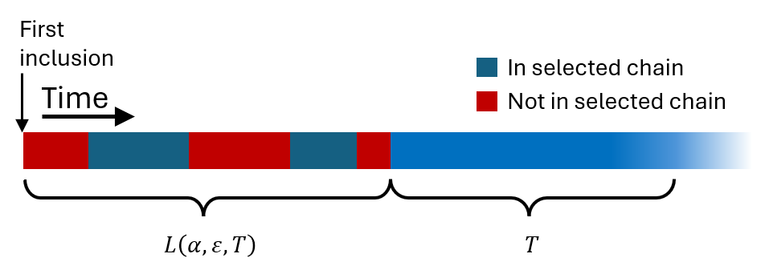
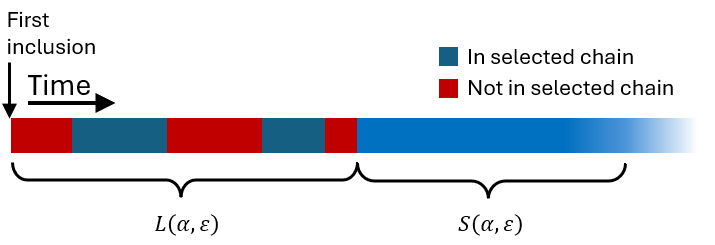

# A Security Model for Blockchain Consensus

We now start the process of defining security notions for blockchains.

As we have learned in the previous section, the first thing we need to describe is the _environment_ (i.e. the _model_) we are working in. That is, we need to introduce all of the assumptions we have about the abilities of the attacker.

There are several ways to go about this, depending on what properties you want to discuss. I chose to go with a rather simple model, that is just enough for the depth of discussion I plan for the rest of the book.

## The Network Delay

The network delay, denoted by $$D$$, is the time it takes the entire honest network to learn of a newly discovered block that was not withheld. If the network is entirely honest, $$D$$ is the time you would have to wait before you know no new blocks were discovered before you started waiting. That is, by the time $$t+D$$,  all network nodes are guaranteed to have heard of all blocks created before time $$t$$.

In the general case, you are still guaranteed that all network nodes know of all _honest_ blocks created before time $$t+D$$. Note that I say honest and not _rational._ The reasons for that will become very clear in the next section.

Note that blocks _may_ traverse the network a lot faster, the network delay is a _bound_, not an absolute number.


Codifying the network delay into our model already means it is too restricted to analyze _parameterless_ protocols such as DAGKnight. In fact, properly analyzing DAGKnight (and retroactively understanding the security of SPECTRE to the fullest extent) required _coming up with a new model_ which is arguably a scientific contribution whose significance is not too far removed from the protocol itself.&#x20;


## The Confidence Parameter

One of the details we encoded into our sample security definition above is that the receiver of funds on a blockchain can never expect _complete_ confidence that a transaction will never revert, because of the probabilistic nature of proof-of-work. We implicitly stated that "the revert probability is a negligible function of $$T$$", but that's not a good way to go about this innate uncertainty. Especially not when we consider [confirmation times](confirmation-times.md).

The _confidence parameter_ is some number $$\varepsilon > 0$$ that describes how much risk the receiver is willing to take: they would not consider a transaction accepted unless the probability it reverts is below $$\varepsilon$$.

A linguistic source of many misunderstandings is that a lower $$\varepsilon$$ means _more confidence_. Much like the case of [difficulty](../chapter-1-bft-vs.-pow/how-pow-works.md#difficulty-adjustment), when we talk about "the confidence" we will usually mean our confidence that the bad thing does _not_ happen. That is, we _actually_ refer to $$1-\varepsilon$$.

Sometimes, we will use $$\varepsilon$$ to denote the _effective_ confidence, not some expectation set by the receiver. I.e., we can use a notation like $$\varepsilon = O\left(e^{-T}\right)$$ to mean that "the confidence you get increases exponentially as time passes".


This is a bit tricky. When we say that a number [_grows exponentially_ ](../../supplementary-material/math/stuff-you-should-know/asymptotics-growth-and-decay.md#exponentials)we mean that it _grows infinitely large very fast_. The number $$1-\varepsilon$$ can't grow exponentially. Indeed, it can't even be larger than $$1$$. What we actually mean when we say that "the confidence grows exponentially" is that its distance from $$1$$, which is just $$\varepsilon$$, _decays_ exponentially.

It is one of these sorts of linguistic overloading that anyone who wants to dive into any established theory has to get used to.


## Block Creation

We assume each miner in the network has some fraction $$\phi$$ of the network, which is the probability that this miner creates the first block. We assume that $$\phi$$ is fixed throughout. If we consider several miners with fractions $$\phi_1,\ldots,\phi_k$$ then the probability the next block is created by _one_ of these miners is $$\phi_1 + \ldots + \phi_k$$.

We assume that there is some fixed _block delay_ $$\lambda$$ such that a block is created, on average, once per $$\lambda$$. More precisely, we assume that the block creation process is a [Poisson process](../../supplementary-material/math/probability-theory/the-math-of-block-creation.md#poisson-processes) with parameter $$\lambda$$, and consequentially, the blocks created by a particular miner with fraction $$\phi$$ produces blocks in a Poisson process with parameter $$\lambda/\phi$$.

For example, in Bitcoin the block delay is $$\lambda = 10\text{ mins}$$, so a miner with $$\phi = 1/4$$ creates, on average, one block per $$\lambda/\phi = 40\text{ mins}$$.

Note that this _includes orphaned blocks_. That is, we only require that a miner with fraction $$\phi$$ creates $$\phi$$ of the blocks, not $$\phi$$ of the blocks _on the selected chain_.

## The Adversary

Recall the fine line we are attempting to walk here: we want an adversary strong enough to capture as many attack vectors as possible, but not too strong, because then it would be impossible to defend against it.

We assume what's usually called a _byzantine attacker_, which is a very powerful kind of attacker. The byzantine attacker suffers no delays, they _instantly know_ of all blocks created, by them or others on the network. Even if we think of the attacker as many disparate nodes, we assume that these nodes can communicate instantaneously.

Additionally, we assume that the adversary can delay _any message_ (say, containing block data) between _any two nodes_. The only limitation is that it cannot make a message take longer than $$D$$ to arrive at the entire network.

Finally, we assume that the adversary has some (possibly unknown) fraction of the network, that we denote $$\alpha$$. So saying we consider an attacker with at most $$45\%$$ of the hashrate is the same as setting $$\alpha = 0.45$$.

Sometimes, instead of saying "an attacker with fraction at least $$\alpha$$" we just say an $$\alpha$$-attacker. Note that an attacker with _more_ than $$\alpha$$ is still considered an $$\alpha$$-attacker, it is just easier that way.

Sometimes, it will be more comfortable to use $$\delta$$ to denote how larger than half the _honest_ fraction is. In other words, $$\delta = \frac{1}{2} - \alpha$$.

## Inclusion and Approval Times

We now introduce two quantities that will be very useful, but are also a bit annoying to explain.

The idea is this, we want to measure _how long the transaction has consecutively been_ and _how long since it was first included in the blockchain and until this started to happen._

Say that, for some reason, we decided that the former quantity is ten seconds. Then the latter probability becomes "how long would it take for the transaction to be added to the selected chain such it would stay there for ten seconds?

We thus define $$L(\alpha,\varepsilon,T)$$ to be how long (on average) you would have to wait to guarantee with confidence $$\varepsilon$$ that the transaction was added to the selected chain and _will_ stay there for at least $$T$$. The future tense on the word "will" indicates that this time is not counted into $$L(\alpha,\varepsilon,T)$$.

Visually, you could imagine something like this:

<figure><figcaption></figcaption></figure>

Next is the time $$T$$ itself. What do we want it to be?&#x20;

Let $$S(\alpha,\varepsilon)$$ denote how long the transaction has to stay in the selected chain so that there is confidence of $$\varepsilon$$ that an $$\alpha$$-attacker could not revert the transaction. We call this the _approval time_. _This_ is the time we are interested in.

Note that the definition of approval time doesn't care if the selected chain was changed, as long as the new chain also has the transaction in one of its block. So for example, the following scenario will correspond to one contiguous blue stripe, despite two reorgs occurring during this period:

<figure><figcaption></figcaption></figure>

The justification is that even if there are two competing chains, and the can't choose a winner, both chains include $$tx$$. So from the point of view of the merchant who cares about how safe $$tx$$ is, it _doesn't matter_ which chain won.&#x20;


In practice, a scenario as above should _very much concern_ a merchant: since the honest network is split between two similarly heavy chains. It follows that a $$\frac{1}{3}$$-adversary could revert the transaction. This does not mean that the definition of $$S$$ is _wrong_. $$S$$ will naturally be large enough to accommodate that. In particular, if we have a network where such splits of length $$T$$ happens with probability $$p$$, then for any $$\varepsilon < p$$ it will necessarily hold that $$S\left(\frac{1}{3},\varepsilon\right)>T$$,&#x20;

A proper security definition will ensure that $$p$$ decreases exponentially with $$T$$.


The _inclusion time_ $$L(\alpha,\varepsilon)$$ measures how long since the transaction first appeared on the blockchain and until it was added to the selected chain for _at least the approval time_. In other words, it is defined by the icky equation $$L(\alpha,\varepsilon) = L(\alpha,\varepsilon,S(\alpha,\varepsilon))$$.

In pictures:

<figure><figcaption></figcaption></figure>

The quantities are denoted by $$L$$ and $$S$$ to reflect that they are relevant to _liveness_ and _safety_, as we will soon see.

