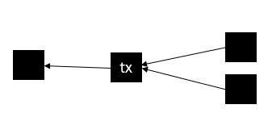

# Confirmation Times

So far we've discussed safety and liveness in their [asymptotic sense](../../supplementary-material/math/stuff-you-should-know/asymptotics-growth-and-decay.md). This is crucial for computer science, but does very little to help a merchant who wants to know _how long_ to wait before acceepting a transaction (or at least, for a developer who wants to know how long to wait before signaling to the merchant that the transaction is OK).

## Ah Yes, the Two Kinds of Security

In this section, we are going to define _a confirmation_ as an additional block on the heaviest branch that contains our transaction of interest. Some people will object to that, saying that confirmations have nothing to do with blocks, only with real world time, and if you are receiving say, a transaction worth $1000, you should wait long enough so that a 51% attack will cost more than that.

So who is right here, advocates of counting blocks, or of measuring time? Which is the correct form of security.

The answer is that _it depends_, security against _what_?

Recall that we already acknowledged that safety and liveness only make sense against an $$\alpha$$ attacker for some $$\alpha<1/2$$. That is, we already explicitly assume no $$51\%$$ attack. The economical consideration can be used to argue what $$\alpha$$ is reasonable to assume.

In a network where there is no guarantee against arbitrarily long $$51\%$$ attacks, there could be no confidence.

That being said, I maintain that waiting long enough so that a $$51\%$$ attack costs more than the value of the transaction is a very bad way to quantify security, for a variety of reasons. For example:

1. The "cost" of a 51% attack is usually monetized (e.g. in websites such as [Crypto51](https://www.crypto51.app/)), by estimating the energy cost of a single hash (estimated from the miner retail market) and multiplying it by the global hashes per hour to obtain the "cost" of one hour of attack. The problem? It assumes that operational costs dominate the mining market. At the time of writing, Crypto51 estimates the cost of one hour of attacking Kaspa around $16k. So does that mean that if I have $16k to spend, I can revert an hour old transaction? Not really. To do that, I need to somehow procure enough hardware. In a coin mined by generic hardware such as GPUs or FPGAs, that might be a concern. However, for a coin mined by custom ASICs, the _hardware cost_ and _scarcity_ are a much more dominant factor. This becomes even more pronounced if the hash used for mining is ASIC friendly, making the operational costs an even smaller fraction than the mining expenditure.
2. A double-spend attack doesn't revert just one transaction. It may _target_ just one transaction, but _all transactions in the vicinity_ are reverted as well. Say you are waiting for the confirmation of a $1000 transaction, but there is also a $1000000 transaction in the same block, or one block before, or six blocks before, does that not mean you have to wait a lot longer? If a very expensive transaction is posted, one that is more expensive than 24 hours of a 51% attack, does that mean no one should accept a transaction for the next 24 hours?

I think the truth is subtler than that. We _do need_ an economic model to tell us that a, say, 40% attack is unfeasible. However, this model has to be much subtler than energy$$\times$$time. Unfortunately, literature about properly monetizing the feasibility of 51% attacks suffers from a severe case of not existing.

We will overcome this like everyone does: by using an abstract value of $$\alpha$$ and leaving the choice of what a "reasonable" $$\alpha$$ is to the merchant.

## Counting Confirmations

The measure by which we express confidence is _confirmations_. What is a confirmation? That's a bit tricky, and it depends on the chain selection rule.&#x20;

For example, in rules like HCR and GHOST, if the network hashrate is fixed then we can define the confirmation in terms of the _number_ of blocks alone (which is why the word _counting_ is used), but in real-world situations, this count becomes _weighted_ by the _difficulty_ of each block.

The [PoEM rule](three-chain-selection-rules.md#proof-of-entropy-minima-poem) is even more confusing, because blocks are weighted even in the fixed difficulty case.

For simplicity, we will assume that the global hashrate is fixed, and that the underlying chain rule does not assign weights to blocks (if that makes you more comfortable, you can just assume it is either HCR or GHOST). This allows us to abstractly talk about the _number of confirmations_.

Beware that the proper way to count confirmations still depends on the chain rule. For example, in this scenario:

<figure><figcaption></figcaption></figure>

$$\mathsf{tx}$$ has _one_ confirmation if we use HCR, but _two_ confirmations if we use GHOST.

We will denote by $$\varepsilon(C,\alpha)$$ the confidence against an $$\alpha$$ attacker after accumulating $$C$$ confirmations.

## Confirmation Times in Bitcoin

Computing $$\varepsilon(C,\alpha)$$ explicitly for Bitcoin is not an easy feat, but it is possible. If you want to see how it is explicitly computed, you can follow the fun paper [The Mathematics of Bitcoin](https://ems.press/content/serial-article-files/11512), by Cyril Grunspan and Ricardo Pérez. In there, they work out the terrifying expression

$$
\varepsilon(C,\alpha)=\frac{\Gamma\left(C+\frac{1}{2}\right)}{\sqrt{\pi}\Gamma(C)}\intop_{0}^{\alpha(1-\alpha)}\frac{t^{C-1}}{\sqrt{1-t}}dt
$$

where $$\Gamma$$ is the universally loved [Gamma function](https://en.wikipedia.org/wiki/Gamma_function).

We are definitely _not_ going to work with this monstrosity. I just included it here for your appreciation.

The complexity of this expression stems from accounting for subtle details such as the discrete nature of block creation, the variance (and higher moments) of block delays, orphan rates, and so on. A lot of phenomena that become less dominant as more confirmations are accumulated.

In the next section, in the process of sketching the security proof of Bitcoin, we derive the much simpler approximation

$$
\varepsilon(C,\alpha) \approx \left(\frac{\alpha}{1-\alpha}\right)^C\text{.}
$$

(Complete post)
