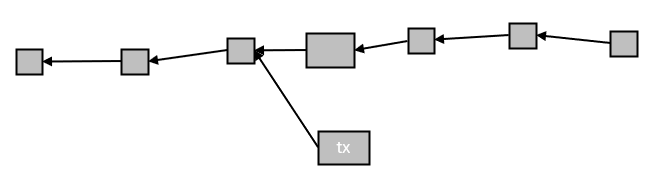
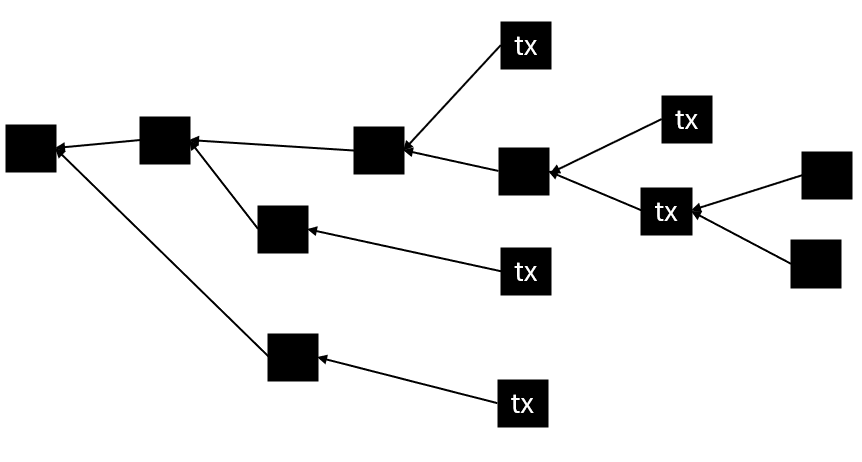
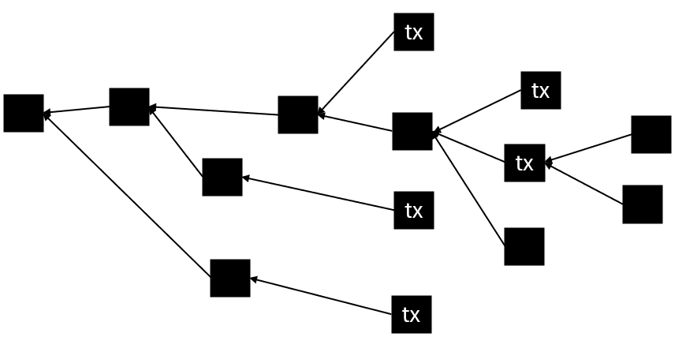
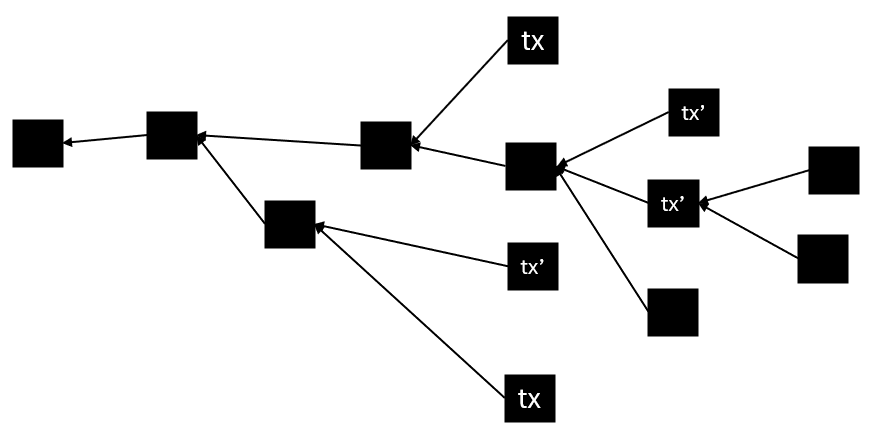
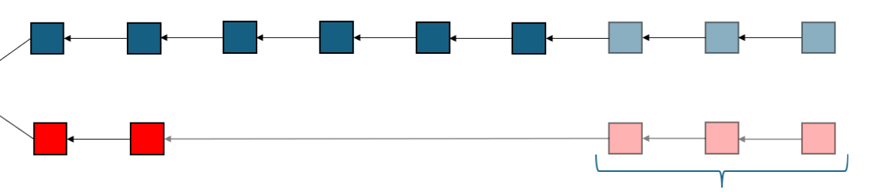
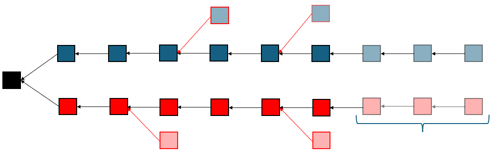
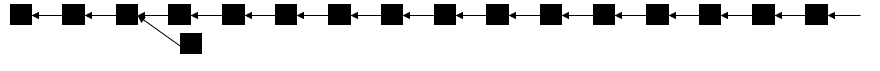
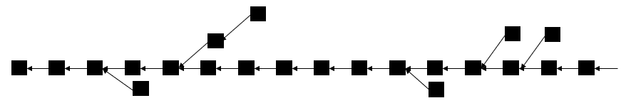

# Liveness

Like the safety property deals with approval times, liveness deals with the [inclusion time](a-security-model-for-blockchain-consensus.md#inclusion-and-approval-times) $$L(\alpha,\varepsilon)$$.


What we call _inclusion time_ is **not the same** as what's typically called "_first_ inclusion time". The first inclusion time measures how long before a transaction is posted to the mempool and until it appears on _any_ block in the chain. The inclusion time measures the time _from_ first inclusion until inclusion.


Recall that inclusion time is _not_ how long before the transaction is on the selected chain, but until it appears on the selected chain, and _stays there for sufficiently long_. This definition is a bit awkward, because you can't _know in advance_ if the transaction is going to stay on the selected chain for sufficiently long. The only way to _measure_ $$L(\alpha,\varepsilon)$$ for a particular transaction is to wait until the transaction _stayed_ on the selected chain for at least $$S(\alpha,\varepsilon)$$.

This should not bother you. The purpose of the quantity $$L(\alpha,\varepsilon)$$ is to carry out analysis. Unlike the quantity $$S(\alpha,\varepsilon)$$, there is no need to know the quantity $$L(\alpha,\varepsilon)$$ in advance to estimate how secure your transaction is. In the next section we consider confirmation times, and see that they are considered in terms of $$S(\alpha,\varepsilon)$$.

It's tempting to try and define $$L(\alpha,\varepsilon)$$ like we did $$S(\alpha,\varepsilon)$$. That is, somehow along the lines of: liveness means that for _any_ transaction, we will have that $$L(\alpha,\varepsilon)$$ is sufficiently small.

However, that is not quite the case. There are two scenarios where we expect transactions to satisfy $$L(\alpha,\varepsilon) = \infty$$. When the transaction is _only_ on an orphaned block, and when it is one of several conflicting transactions.

We can ignore this, and take liveness on an intuitive level as "conflicts are eventually resolved". For completeness, I include an optional discussion about how we could define it formally.

## Unavoidable Sets of Transactions\*

For brevity, let us denote $$L_{\mathsf{tx}}(\alpha,\varepsilon)$$ when we consider a particular transaction.

The antichain condition, that we will now define, elegantly captures all problematic cases.

It is possible that a transaction only appeared on one block, and this block&#x20;

Also, if a transaction happens to appear only on an orphaned block, it will _never_ be on the selected chain:

<figure><figcaption></figcaption></figure>

In this case, we have that $$L_\mathsf{tx}(\alpha,\varepsilon)=\infty$$, and that's _perfectly fine_.

However, if the selected chains of _all tips_ contain $$\mathsf{tx}$$, then we do expect that $$L_\mathsf{tx}(\alpha,\varepsilon)$$ should be sufficiently small.

To better discuss this, we will need a notion called a _maximal antichain_:

**Definition**: A collection of nodes in a DAG is called a _maximal antichain_ if the chain of _any_ tip goes through it exactly once

<figure><figcaption></figcaption></figure>

Assume a transaction appears on all the blocks of an antichain, like so:

<figure><figcaption></figcaption></figure>

Then in that case we _do_ expect that $$L_\mathsf{tx}(\alpha,\varepsilon)$$ remains small, but _only as long as this condition keeps happening_. If suddenly a new parallel block appears that does not contain $$\mathsf{tx}$$ appears, like so:

<figure><figcaption></figcaption></figure>

then our definition must accommodate the possibility that eventually the selected chain will not contain $$\mathsf{tx}$$.

In all fairness, this is not a huge limitation at all. Most commonly, transactions are posted to the mempool, which means that they would appear in _many_ blocks. If all miners of parallel blocks had the same view of the mempool, there is a good chance the all included the same transactions. So if a transaction was posted with no conflict, it is typically a matter of time before it will occupy an antichain.

We also note that we do not _require_ the transaction to be present in an antichain of blocks. Eventually, if it is in the selected chain for $$S(\alpha,\varepsilon)$$ then the safety property furnishes confidence of $$\varepsilon$$ it will not revert, regardless of antichains.

Another thing scenario we want to consider is that of conflicts. Say that $$\textsf{tx}$$ and $$\textsf{tx}'$$ are two conflicting transactions that appear in the block tree like this:

<figure><figcaption></figcaption></figure>

We expect that $$L_\mathsf{tx}(\alpha,\varepsilon)  = \infty$$ or $$L_\mathsf{tx'}(\alpha,\varepsilon) = \infty$$, _but not both_. We not? Because if we look at the blocks that contain _either_ $$\textsf{tx}$$ _or_ $$\textsf{tx'}$$ we _do_ get an antichain! We say that the collection of transactions $$\{\mathsf{tx},\mathsf{tx'}\}$$ is what we call _unavoidable_.

More generally, a list of transactions $$T$$ is called _unavoidable_ if the set of blocks containing at least one transaction from $$T$$ contains an antichain. That is, if we choose _any_ tip and traverse its selected chain to genesis, we are guaranteed to hit at least one transaction from $$T$$ at some point. In this case, we expect that there is _at least one_ $$\textsf{tx}\in T$$ such that $$L_\textsf{tx}(\alpha,\varepsilon)<\infty$$. We actually expect something stronger: that $$L_\textsf{tx}(\alpha,\varepsilon) = O(1/\log\varepsilon)$$.

Compiling this into a definition is a bit delicate, as it requires taking into account the possibility that $$T$$ might become avoidable in the future. I defer this task to the exercises.

## Liveness of GHOST

Imagine a blockchain that uses the GHOST protocol, and sets its block delays to be significantly smaller than the network delay, and assume the position of a $$10\%$$ attacker.

Recall that we always assume the worst-case reasonable attacker. In particular, in decentralized consensus, we assume an all-powerful _byzantine_ attacker. In particular, the attacker is allowed to delay _any_ message by as much as the network delay.

The attacker can use their ability to split the honest network into two chunks, such that each chunk contains about the same hash power (as long as the difference between them is smaller than the hash-rate of the attacker, the attack should work). She can then use her powers to delay any messages between the two chunks by as much as possible, effectively making them compete with each other.

If we assume for now that the attacker does not create blocks, after a while the neetwork would look a bit like this:

<figure><figcaption>
A simple depiction of a balancing attack. Blue and red blocks represent the two isloated groups, and the blue curly bracket represents the network delay. Blocks that were created by one group but not yet arrived to the other groups have lighter colors.
</figcaption></figure>

Now recall that blocks aren't created in regular intervals and in fact, the block creation process is [incredibly noisy](../../supplementary-material/math/probability-theory/the-math-of-block-creation.md). So even if the two groups are perfectly balanced, at some point we will run into a situation similar to this:

<figure><figcaption></figcaption></figure>

where one side of the conflict had a lucky burst large enough to look heavier even to the _other side_. In the example above, at this point the red group will switch to mine over the latest blue block, ending the split.

But what if the attacker in the meantime uses her hashrate to sprinkle blocks on both sides of the split?

<figure><figcaption></figcaption></figure>

If she has enough hash-rate (namely, her hashrate is bigger than the _difference_ between the hashrates of two groups), she could strategically release her blocks to prevent the two groups from reconciliating _indefinitely_, ruining the liveness of the network.

Another variant of this strategy attempts a $$51\%$$ attack: instead of creating blocks on both sides, the attacker sends _transactions_ to the larger side, and mines blocks on the smaller side. After the network accepts her transactions as confirmed, she releases all the blocks on the lighter side, creating a reorg. The success probability of this attack _does_ decrease exponentially over time, but not fast enough, since the balance attack increases $$L$$ arbitrarily.

Such attacks are called _balancing attacks_.


In practice, such attackers do not exist. However, when operating in very high block rates, it is still the case that such "chunks" that are well connected among themselves but poorly connected with other chunks could naturally form. Identifying and responding to these chunks makes a balancing attack harder to pull off, but not impossible, as demonstrated in several simulations, most famously the [experiment by Natoli and Gramoli](https://arxiv.org/abs/1612.09426).


Note that balancing attacks work because the attacker blocks, despite not being on the longest chain, still add weight to one of the sides, making this attack very unique to GHOST.

What saves us from this attack is that if the block rate is _sufficiently low_, we will see long stretches where the network looks like a chain, prohibiting a balance attack below that chain.

&#x20;So if a typical HCR block tree looks like this:

<figure><figcaption></figcaption></figure>

GHOST allows moderately increasing block rates to obtain a block tree that looks more like this:

<figure><figcaption></figcaption></figure>

The orphan rates increase without degrading safety, because their weight is counted into the chain, and without degrading liveness, because there are sufficiently common long stretches of orphanless chains, forcing the balancing adversary into a block race.

It is fair to say that GHOST sacrifices a bit of robustness against liveness attacks to gain much more resiliency against double-spending attacks when operating in orphan-inducing rates. This is why GHOST chains furnish security similar to Bitcoin with block delays as much as twenty times shorter.
