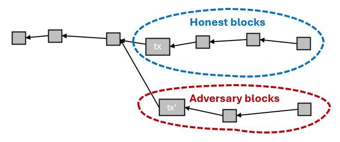
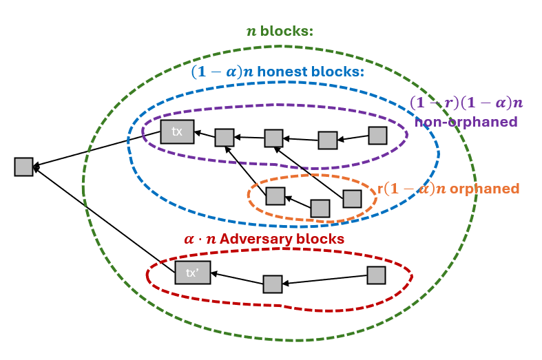
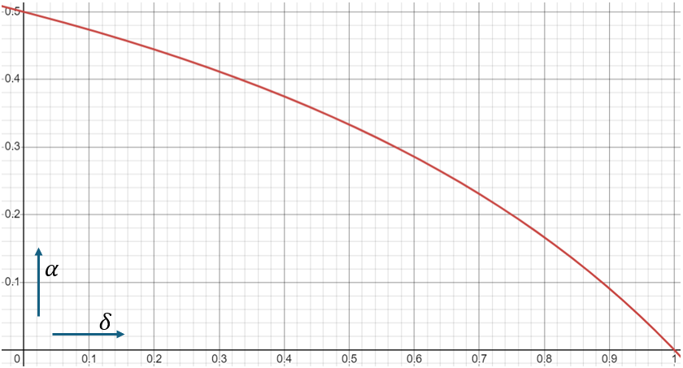

# Safety

The _safety_ property is a statement about how long the transaction has to be on the selected chain before we have our confidence that a transaction won't revert is at least $$\varepsilon$$. That is, with the [approval time](a-security-model-for-blockchain-consensus.md#inclusion-and-approval-times) $$S(\alpha,\varepsilon)$$.

We already agreed there is no hope to defend against a $$\frac{1}{2}$$-attacker, so we assume $$\alpha < \frac{1}{2}$$.

For such $$\alpha$$, we want the confidence to grow exponentially fast. In other words, if we make $$\varepsilon$$ twice as small, we _don't_ want $$S(\alpha,\varepsilon)$$ to be twice as large. In fact, we want something much stronger: that no matter how many time we halve $$\varepsilon$$, each time would add a _constant_ amount of time. If you have some background (say, from [reading about logarithms](../../supplementary-material/math/stuff-you-should-know/asymptotics-growth-and-decay.md#logarithms) in the appendix), you know that such a relationship between $$S$$ and $$\varepsilon$$ can be expressed [asymptotically](../../supplementary-material/computer-science/stuff-you-should-know/asymptotic-notation.md) by the following equation:

$$
S(\alpha,\varepsilon) = O\left(\log(1/\varepsilon)\right)
$$

This motivates the following:

**Definition?** The protocol is _safe_ if for any $$\alpha < 1/2$$ it holds that $$S(\alpha,\varepsilon) = O\left(\log(1/\varepsilon)\right)$$

The problem with this definition is that, as it turns out, it is _impossible to satisfy_.


This definition is impossible to satisfy, yet DAGKnight _does_ satisfy it. How is it possible?

Being parameterless, it could _adjust_ to varying network conditions and thus protect against _any_ $$\alpha$$-adversary as long as $$\alpha<\frac{1}{2}$$ (although the confirmation times shoot exponentially fast through the roof as $$\alpha$$ approaches $$\frac{1}{2}$$).

When we say no protocol can satisfy this property, this only holds for protocols that can be analyzed on our model. DAGKnight cannot be, because we assume a fixed latency bound, while DAGKnight, in some sense, _responds_ to varying delays, even if they grow longer than our assumed $$D$$. If we tried to analyze DAGKnight in this model, we would have to cap off its adjustment ability (thus actually analyzing a protocol that is weaker than DAGKnight), and the "unhandled cases" will slightly decrease the size of attackers we can handle.


Before we understand how to correct the definition, we discuss a magical world where it _can_ be satisfied, and is actually satisfied by Bitcoin.

## Imagine a World With No Orphans

Consider how Bitcoin works under the following unrealistic assumption: the honest network _never_ creates orphan blocks. That is, all honest blocks to ever have and will be created are arranged in a chain.

Hence, even when attacked, the network looks something like this:

<figure><figcaption></figcaption></figure>

where $$tx$$ is the transaction the adversary tries to double-spend and $$tx'$$ is a conflicting transaction.

We expect the honest network to create $$1-\alpha$$ blocks for any $$\alpha$$ blocks created by the attacker. In other words, the honest network createes blocks $$\frac{1-\alpha}{\alpha}$$ faster. No matter what $$\alpha$$ is, as long as it is smaller than $$\frac{1}{2}$$, the gap between the honest and adversarial chain will increase. And, as we reason later, the probability that the adversary reverts the chain decreases exponentially with this gap.

## Orphans and the Scaling Problem

In reality, orphans _do_ exist in the honest network. However, recall that we assumed that the adversary can arrange their blocks in a perfect chain. This means that the attacker can revert the chain with less than half the hashing power. Say that the honest network orphans one in three honest blocks, and that $$\alpha = 40\%$$. We find that the honest network creates $$60\%$$ of the blocks, but a third of them goes to waste, so only two thirds of that, namely $$40\%$$ of all the blocks, are _honest network blocks_. This means that although $$\alpha < \frac{1}{2}$$, the adversary and honest network are neck to neck. If we slightly increase the adversary fraction to $$41\%$$, the attack will almost certainly succeed.

More generally, say that a fraction of $$r$$ of the honest blocks is orphaned. For any $$\alpha$$ blocks created by the adversary, the honest network creates $$1-\alpha$$ blocks, but only $$(1-r)(1-\alpha)$$ will be honest _chain_ blocks:

<figure><figcaption></figcaption></figure>

Hence, the network has no hope against an $$\alpha$$-adversary unless $$(1-r)(1-\alpha) > \alpha$$. Note that the no-orphans case described above is exactly when $$r=0$$, and we get the usual equation $$1-\alpha > \alpha$$, or $$\alpha < \frac{1}{2}$$.

If we solve the more general equation for $$\alpha$$ we get the following condition:

$$
\alpha < \frac{1}{2}\left(1-\frac{r}{2-r}\right)
$$

You can check that the right-hand side is $$\frac{1}{2}$$ for $$r=0$$, and goes to $$0$$ as $$r$$ approaches $$1$$, let us plot it:

<figure><figcaption></figcaption></figure>

Strictly speaking, we conclude that Bitcoin could never satisfy the safety definition we proposed above. The orphan rate is _always_ positive. The Bitcoin orphan rate is estimated to be at most one in $$150$$, so if we plug $$r=1/150$$ into our formula, we get that Bitcoin is "only" safe against adversaries with at most $$49.999\%$$ of the hashrate.

This almost makes it seem as though there are no repercussions to this entire orphan thing, and we can just ignore it. But that's _wrong_. Bitcoin's very low throughput is the price Satoshi had to pay to obtain such a small orphan rate.

More generally, $$r$$ is mostly determined by two quantities: the block delay $$\lambda$$, chosen by the protocol designer, and the network latency $$D$$, which is also somewhat determined by the protocol designer. "Huh?" you ask, how can the protocol designer affect the network latency? By choosing the block size! Larger blocks take longer to traverse the network. This is _not_ because they contain more data, that actually has negligible effect. It is actually because the data needs to be _verified by each node,_ and the verification process typically grows linearly with the size of the block (verifying $$4000$$ transaction inputs will take about four times longer than verifying $$1000$$ transaction inputs).

To ensure a low orphan rate, Satoshi suggested to parameterize Bitcoin such that $$\lambda \gg D$$. It is _this_ requirement that protects us from high orphan rates degrading the security. It is **this requirement** that is more commonly known as "the Bitcoin scaling problem".

## The Math of Orphans\*

It is common to wonder wether a ten-minute block delay is an exaggeration. Won't we be fine if we decrease it to, say $$30$$ seconds?

To better understand the consequences, we will quickly analyze the relationship between $$\lambda$$, $$r$$, and $$D$$.

A necessary (and almost sufficient) condition for an orphan to be created is that more than one block is created within a period of $$D$$. As [explained in the appendix](../../supplementary-material/math/probability-theory/the-math-of-block-creation.md), the number of blocks created in this period ditributes as $$Poi(D/\lambda)$$. Using the approximation $$e^{-x}\approx 1-x$$

&#x20;we can compute that

$$
\begin{aligned}\mathbb{P}\left[Poi\left(\frac{D}{\lambda}\right)\ge2\right] & =1-\mathbb{P}\left[Poi\left(\frac{D}{\lambda}\right)<2\right]\\& =1-\mathbb{P}\left[Poi\left(\frac{D}{\lambda}\right)=0\right]-\mathbb{P}\left[Poi\left(\frac{D}{\lambda}\right)=1\right]\\& =1-\frac{\left(D/\lambda\right)^{0}\cdot e^{-D/\lambda}}{0!}-\frac{\left(D/\lambda\right)^{1}\cdot e^{-D/\lambda}}{1!}\\& =1-e^{-D/\lambda}-\frac{D}{\lambda}\cdot e^{-D/\lambda}\\& =1-e^{-D/\lambda}\left(1+\frac{D}{\lambda}\right)\\& \approx1-\left(1-\frac{D}{\lambda}\right)\left(1+\frac{D}{\lambda}\right)\\& =\left(D/\lambda\right)^{2}\end{aligned}
$$

So we expect at least $$(D/\lambda)^2$$ orphans per _network delay_. And since there are $$\lambda/D$$ block delays in a network delay, we expect at least $$(D/\lambda)$$ orphans in a block delay.

The approximation $$e^{-x}\approx 1-x$$ is only accurate for very small values of $$x$$. That is, under the assumption that $$\lambda \gg D$$. But we can clearly see that in this regime the orphan rate is _inversely proportional_ to the block delay. That is, by making the block delay twice shorter, we double the rate of orphans, and so on. In particular, decreasing the Bitcoin block delay to, say $$30$$ seconds, will cause at least $$20$$ as many orphans. Now instead of $$r=1/150$$ we have $$r=2/15$$, and putting it into the equation we get that the threshold for double-spend attacks reduced to $$\alpha \approx 46.5\%$$.

That might not _seem_ that much, but when we analyze confirmation times we will see this has very tangible bearings on how long it takes to confirm a transaction.

Also, keep in mind that we only computed a lower bound on the number of orphans, and a very rough one at that. We only considered cases where a _single block_ is orphaned, and did not take into account the scenario that longer chains of two, three, or more blocks, are also orphaned. These events become increasingly likely as orphan rates increase, making non-negligible higher-order contributions to the orphan rates.

## Digression: Orphans and Difficulty

It is a common misconception that “orphan rates decrease gains for miners”. This misunderstanding follows from the reasonable thought that if we have to throw blocks in the garbage then whoever mined this block is in the loss.

However, that is not quite the case. The difficulty adjustment algorithm only controls the issuance rate of _non-orphan_ blocks. There is no other way: since difficulty has to be in consensus, it can only depend on blocks that are on the chain.

In particular, if we have, say, an orphan rate of 20%, then mining blocks will be 20% easier, increasing the block rates to compensate. Yes, one fifth of the blocks you make will go to the trash, but you will make 1.25 times more blocks, giving you the same rate of non-orphan blocks.

You might be tempted to think that a 20% orphan rate implies only 80% of the hash rate you see on the blockchain goes towards non-orphan blocks. So if the difficulty requires one tera hash per second to see a block every ten minutes, then an adversary will only need 800 giga hash to 51% attack the network. Again, this is not the case, the hash rate read off the difficulty _only_ takes non-orphan blocks into account. This (combined with the fact that nodes do not broadcast blocks they see as orphans) makes measuring orphan rates in practice extremely difficult (especially if we consider that old orphans can be forged for cheap).

That being said, there _are_ adverse consequences to high orphan rates (besides the wasted work): they introduce noise that increases confirmation times, and increase the advantage for miners with a better internet connection.

## The Correct Definition

So if we want any hope for a security definition that is actually feasible, we need to accept the fact that our assumption on a fixed network delay comes with the price of having to _choose_ some $$\delta > 0$$, and then set the parameters such that the network is secure assuming $$\frac{1}{2} + \delta$$ of the miners are honest.

One might be tempted to use the expression we derived for $$\alpha$$ in the definition, but that would be a mistake. This computation was _specific to Bitcoin_. Our definition needs to be _general_. In fact, it shouldn't use the word _orphans_ at all, as this would be too presumptuous. Orphans are just _one way_ that things can go wrong, but we need to be ready for anything.

The property of orphans that interests us is this: as $$D/\lambda$$ goes to zero, the orphan rate also goes to zero, and with it (though we have yet to prove it!), the required $$\delta$$. _This_ is the magic property that we want.

This leads us to the following:

**Definition**: A blockchain protocol is $$\delta$$_-safe_ if for any $$\alpha < \frac{1}{2} - \delta$$ it holds that $$S(\alpha,\varepsilon) = O(\log(1/\varepsilon))$$. A protocol is _safe_ if it is $$O(D/\lambda)$$-safe.


For those not used to [asymptotic notation](../../supplementary-material/computer-science/stuff-you-should-know/asymptotic-notation.md), it might seem "complicated" to write something like "$$O(D/\lambda)$$-safe", but it is actually a _great_ example of how asymptotic notation can help us conveniently focus on what matters to us: that as $$D/\lambda$$ goes to $$0$$, the value of $$\delta$$ required so that we could be $$\delta$$-safe also goes to $$0$$. The relationship between $$D/\lambda$$ and $$\delta$$ could be arbitrarily complicated, but we don't mind. We only care that they vanish together.

For a bit more big o evangelism, let us rewrite this definition without using asymptotic notation:

A blockchain is $$\delta$$-safe if for any $$\alpha < \frac{1}{2} - \delta$$ it holds that there is some constant $$C$$ such that $$e^{C\cdot S(\alpha,\varepsilon)} < 1/\varepsilon$$. It is safe if for any $$\delta$$ we could choose $$D$$ and $$\lambda$$ such that it is $$\delta$$-safe.

I think this mess makes a compelling case that even though asymptotic notation takes some getting used to, it allows us to neatly and elegantly discard irrelevant information and succinctly state the information that remains.

&#x20;


