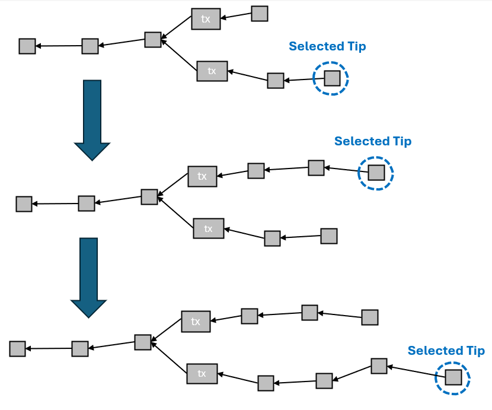

# Safety

We are _finally_ positioned to talk about the security of a blockchain, and the property to start this discussion with is the so-called _safety_.

The safety property is a statement about _how likely_ it is that a given transaction reverts as a function of _the time it has been on the selected chain_. This is complemented by the [liveness property](liveness.md), introduced in the next chapter, which is a statement about how long we have to wait _before_ such a chain arrives.

Interestingly, the safety definition for a transaction does not care _what the selected chain is_ or _whether it changed_, only _how long the transaction has been on the selected chain_.

So if we consider a scenario like this:

<figure><figcaption></figcaption></figure>

The selected chain has changed _twice_ during this time, yet the safety clock is still ticking. Why? Because even though the two chains are competing, _both_ contain $tx$, so $tx$ will not be reverted no matter what chain wins.

## Adversary Fraction

Remember that when we defined security, we always have&#x20;

