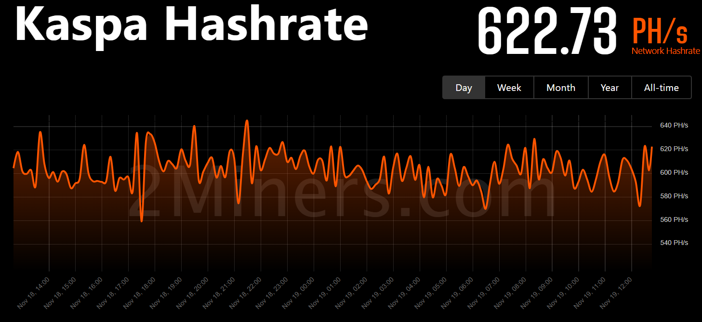

# Selfish Mining in Bitcoin

Recall that when we described the [block chain paradigm](the-paradigm.md) we said that we expect two things of honest miners: to mine over the selected tip, and to immediately rebroadcast any valid block they learn of. This naturally led to a discussion over what makes these assumptions justified. We addressed this by noting that the Bitcoin network places incentives such that a [_rational_ miner](honesty-and-rationality.md), seeking to maximize profit, will always choose to mine over the selected tip. And what about reporting all blocks immediately? Well, not quite...

## The Rational Miner

We defined a _rational_ miner to be a miner seeking to increase profits from mining. Does that necessarily mean they seek to mine as many blocks as possible? Not exactly. A more accurate description is that they seek to mine the _largest fraction_ of _non-orphaned blocks_ possible. The subtlety, noticed by Ittay Eyal and Emin Gün Sirer in their 2013 paper [Majority is not Enough: Bitcoin Mining is Vulnerable](https://arxiv.org/pdf/1311.0243), is that _the above are not the same_, and that by _withholding blocks_ a miner can _increase their fraction_ by _increasing the chance competing blocks are orphaned_.

I repeat the subtlety: the attack might _decrease_ the _number_ of non-orphaned blocks created by the adversary, but it causes _a larger increase_ in orphan rates of honest blocks, making the _fraction_ of the attacker grow.

How is it that the attacker actually wasted work, but increased is profit? Because he caused _more_ of the honest work to be wasted. Which brings us to why selfish mining is a concern: it is not only about miners getting more than their fair share, its that this strategy, that turns out to be rational, is _degrading the security by increasing orphan rates_.

So the consequences of selfish mining are not only that the rational and honest strategies are not actually aligned, but that the actual rational strategy is detrimental. So how come Bitcoin is still running securely? Well, the good news are that a selfish miner needs a very large fraction of the global hash rate to be profitable, and that selfish mining attacks are detectable.

## Selfish Mining Strategies

They key to a selfish mining attack is _withholding blocks_. We already considered another block withholding attack, a _double-spend attack_. In a double-spend attack, the adversary attempts to _reorg_ the chain. She withholds an _entire competing chain_ and only posts it once it is heavier than the honest chain. Selfish mining is a much more subtle version. You can think of it as constantly attempting to reorg the latest block, and trying again if you fail. Since you don't care _what_ block you want to reorg out, only that you reorg enough honest blocks to increase your fraction, you can always try again.

Say that I am a rational miner, and that I just mined a block. Before broadcasting it to the world, this is my point of view:

<figure><figcaption></figcaption></figure>

An honest miner will report the private block right away, but since I am _rational_, I'd rather wait a little bit and see where the wind is going. Say after a little bit, the honest network created a parallel block, then we are in this situation:

<figure><figcaption></figcaption></figure>

If I keep mining, then there is _some_ chance that I create a block before the honest network, leading to this situation:

<figure><figcaption></figcaption></figure>

At this point I can finally publish the withheld blocks, and they will orphan the honest block:

<figure><figcaption></figcaption></figure>

The point is this: if I had published my first block the second I found it, the honest network would have considered it the selected tip and switched to mining above it. This would have deprived me of the ability to use my temporary advantage to orphan their work, getting a larger share.

However, I don't _have to_. I can try my luck at maybe creating a longer private chain, orphaning out more honest network blocks and further increasing my gain.

What if the honest network mined a block first, bringing us to this situation:

<figure><figcaption></figcaption></figure>

Well, in that case it is also my choice. I can keep going, hoping to take the lead again, or I can release my private chain, which is the same length of the public chain, hoping that the network prefers my side. If I decide to keep mining, most chances that I will _not_ gain the next lead, and find myself in this situation:

<figure><figcaption></figcaption></figure>

So what do I do now? Do I give up on my private chain and restart the attack, or do I keep pushing?

All of the questions above are what defines a selfish mining strategy.

## The Eyal-Sirer Strategy\*

The Eyal-Sirer strategy goes like this:

* Mine over the selected tip:\
  \
  .png>)
* If the honest network found a block before you, restart the attack from the new tip:\
  .png>)
* Otherwise, you have a lead of one block over the honest network, good job! _Keep this block to yourself_ and _keep mining_!\
  .png>)
* If the honest network mined the next block, you are at an impasse:\
  .png>)\
  Release you block to the wild, and hope for the best. For future reference, let $$\gamma$$ be the probability you win in this situation (in a sense, $$\gamma$$ encodes how _well connected_ you are)
*   Otherwise, you are already leading by two blocks, good job! Keep going!\

    <figure><figcaption></figcaption></figure>
*   At some point, the honest network will start to catch up, and you will find that your advantage has shrunk to one block!\

    <figure><figcaption></figcaption></figure>

    This is too close for comfort! Publish your chain. All the honest block created in this time will be orphaned, congratulations! Time to restart the attack

Computing the consequences of this strategy is fun but a bit too involved for our purposes. The results are summarized in this graph:

<figure><figcaption>
(Fig 2. from Eyal-Sirer) Effectiveness of the Eyal-Sirer strategy, for a single selfish miner/collusion working against an otherwise honest network. The x axis represents the selfish hashrate, and the y axis represents the fraction of blocks that they minex
</figcaption></figure>

Here we see an interesting phenomenon: you do not need a majority of the hashrate to create a majority of the blocks! For $$\gamma = 0$$ (the weakest attacker) we see that a third of the hash power is enough to obtain an unfair advantage. For $$\gamma = 1$$, we see that _any_ fraction suffices to have an advantage, and a third suffices to mine _half_ of the blocks!

These results are obviously striking, but some tend to misinterpret them to mean much more: that a majority of one third can double-spend. The argument is "a majority of one third creates more than half of the blocks, so they can create a competing chain and revert any transaction". But that's not really the case. If you watch the attack closely, you would see that it has to _piggyback_ on the honest network blocks and _interleave_ them with their blocks.

A successful revert attack looks something like this:

<figure><figcaption></figcaption></figure>

where as a successful selfish mining attack might look like this:

<figure><figcaption></figcaption></figure>

Note that in the second image , the attacker created $$9$$ out of the $$17$$ chain blocks, which is a majority. However, the network created a total of $$13$$ blocks in this time, which are more than the attacker's $$9$$ blocks. If the attacker arranged her block in a chain, without orphaning the honest blocks, then it would have been a _shorter_ chain, and the effect would have failed.

## Security Definitions

One motivation for presenting selfish mining at this rose from the [discussion about security notions](selfish-mining-in-bitcoin.md#security-definitions), where we stressed that a security notion is only defined with respect to some goal. When talking about the security of Bitcoin, many become tunnel visioned on security against reverting a transaction. We already stressed that this property is _not quite enough_. The inability to revert a transaction is a property called _safety_, and together with the inability to _arbitrarily delay_ a decision, which we will call _liveness_, we get what is _usually_ called "the security" of Bitcoin.

However, I made a hopefully fruitful effort that there is no such thing as "the security", as there could always be other malicious goals that furnish other security properties.

One such example is a property known in the literature as _chain quality_, which informally captures the inability to mine more than your fair share. From this vantage, we can say that Eyal and Sirer were the first to note that a block chain can be secure _while not_ providing chain quality (despite the term _chain quality_ only coined a bit later).

This is a striking example of how attackers (or worse, cryptographers!) can surprise you.

## Selfish Mining and Tie Breaking

Recall the discussion about [tie breaking](the-paradigm.md#breaking-ties) in the block chain paradigm. We said in passing that selfish mining and tie breaking is related, and we can see why if we consider the strategy above. In particular with the number $$\gamma$$.

We said that the number $$\gamma$$ measures how _well connected_ you are. But that's because we were following the Bitcoin "seen first" tie breaking rule. What would have happened if we chose a _deterministic_ tie breaking rule like lowest hash or [PoEM](three-chain-selection-rules.md#proof-of-entropy-minima-poem)?

The answer is that we get some degree of control over $$\gamma$$. Seeing only our block, we can _compute the probability_ that another block will win a tie with us. For example, say we found a nonce for our block that produces a hash _ten times_ _smaller_ than required. I.e. such that $$\mathsf{H}(B[n]) \le T/10$$.

The probability to find another nonce that satisfies this is _ten times smaller_ than required. So the probability that the next _honest_ block will have a lower tie is about $$10\%$$, which could considerably increaser $$\gamma$$! Worse yet, if I am currently _tied_ with the honest network, I can _know in advance_ would would win the tie!

This connection between selfish mining and tie breaking was analyzed by Ren Zhang (from CKB) and Bart Preneel in their 2019 paper [Lay Down the Common Metrics: Evaluating Proof-of-Work Consensus Protocols' Security](https://ieeexplore.ieee.org/abstract/document/8835227), concluding that a deterministic tie-breaking law _must_ degrade chain quality.

In PoEM this seems to even be slightly exacerbated: if the competing blocks has considerably less weight than mine, then I know that my advantage will be preserved for the remainder of the attack. PoEM allows to accumulate advantage, simply because it keeps tabs of _actual_ nonces and not just difficulty adjustment. I have not done the math (I don't think anyone has, at this time), but if I have to guess, I would say that PoEM is _slightly_ more vulnerable to selfish mining than lower-hash tie breaking.

## Further Work

Since Eyal and Sirer's initial observation, selfish mining has become a central theme in PoW research. Bitcoin is thankfully quite resilient to selfish mining, but this observation means that other protocols should be on their toes, providing at least some evidence that they are not susceptible to cheap selfish mining attacks. Unfortunately, some chains tend to ignore this issue, despite concerning evidence. One such example is the Kadena network, whose developers have yet to respond to an analysis by Wang et al. in their 2022 paper [An Analytical Study of Selfish Mining Attacks on Chainweb Blockchain](https://ieeexplore.ieee.org/abstract/document/9851985?casa_token=M0cuWNrr3AIAAAAA:RawM0LcFIQzkd7yF9RpDJB4YdWX6mq73Z2u-oqCxNYHS0aU9UwhhTzh_JfIUUcen2DM6E14spCbU), that provides evidence that selfish mining becomes easier as more chains are added.

Following Eyal and Sirer's observation, A formal framework for studying selfish mining was given by Juan A. Garay, Aggelos Kiayias, and Nikos Leonardos in their 2014 paper [The Bitcoin Backbone Protocol: Analysis and Applications](https://eprint.iacr.org/2014/765.pdf). In that paper, they defined the _chain quality_ property as the fraction of blocks an αα-miner should expect to mine and noted that Eyal and Sirer‘s attack proves that Bitcoin’s chain quality is not ideal.

In 2017, Ayelet Sapirshtein, Yonatan Sompolinsky, and Aviv Zohar published the paper [Optimal Selfish Mining Strategies in Bitcoin](https://link.springer.com/chapter/10.1007/978-3-662-54970-4_30), where they noted that Eyal and Sirer’s attack is not optimal and provided an optimal strategy. Their improvement is particularly interesting as it relies on optimization techniques: the authors noted that for any set of parameters α,γα,γ the optimal strategy is slightly different, and provided an efficient algorithm that computes the optimal policy from these parameters. They noted that the original selfish mining strategy coincides with theirs for γ=1γ=1 and small values of αα.

In the 2018 paper [On Profitability of Selfish Mining](https://arxiv.org/abs/1805.08281), Cyril Grunspan and Ricardo Pérez-Marco provide a subtler analysis of selfish mining. They note that the assumption that γγ is constant is unrealistic (as γγ depends on how long it took to create each block), and show that when incorporating the time variance of γγ into the computation, the honest mining strategy becomes optimal. They conclude that selfish mining attacks are actually attacks on the difficulty adjustment algorithm. In particular, they conclude that a successful selfish mining attack on Bitcoin must persist over several difficulty windows, making it impractical.

However, in the 2020 paper [Selfish Mining Re-Examined](https://link.springer.com/chapter/10.1007/978-3-030-51280-4_5), Kevin Negy, Peter Rizun, and Emin Gün Sirer pointed out a _mistake_ in the computation by Grunspan and Pérez-Marco. Fixing it, they found that selfish mining can be profitable in the constant difficulty setting. They carefully analyze selfish mining in scenarios of varying difficulty and find it is _even more_ confusing. A surprising property is that the attack is affected by how the difficulty adjustment works, and different approaches to adjusting difficulty furnish different efficacies for selfish mining attacks.

A year before that, Guy Goren and Alexander Spiegelman published the paper [Mind the Mining](https://arxiv.org/pdf/1902.03899), where they revisit mining in face of variable difficulty. The attacks in this paper “complement” selfish mining, as they are based on the miner deliberately shutting off some of their hardware. This kind of attack has very different flavor than selfish mining, which assumes attackers have a fixed hash rate. In other words, the analysis of selfish mining implicitly ignores the expenses of the miner, and treat income as pure profit. Taking expenses into account, Goren and Spiegelman find that Bitcoin’s long difficulty epochs enable “win-win” situations: a miner can increase the profits of _all_ miners by reducing their mining efforts (where the reducing miner is “rewarded” in lower energy bills, while the rest are rewarded in higher mining income due to increased difficulty). The loser of this “win-win” is obviously the network itself, whose hash rate, and whereby security, is reduced.

(My deepest gratitude to Ittay Elay for reviewing this post and making invaluable comments and suggestions)
