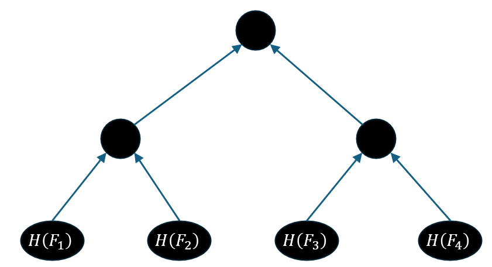
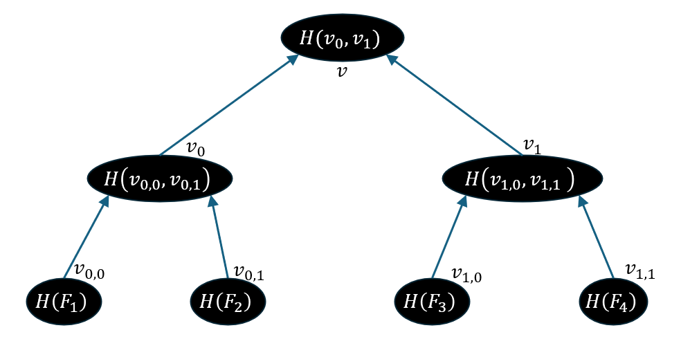
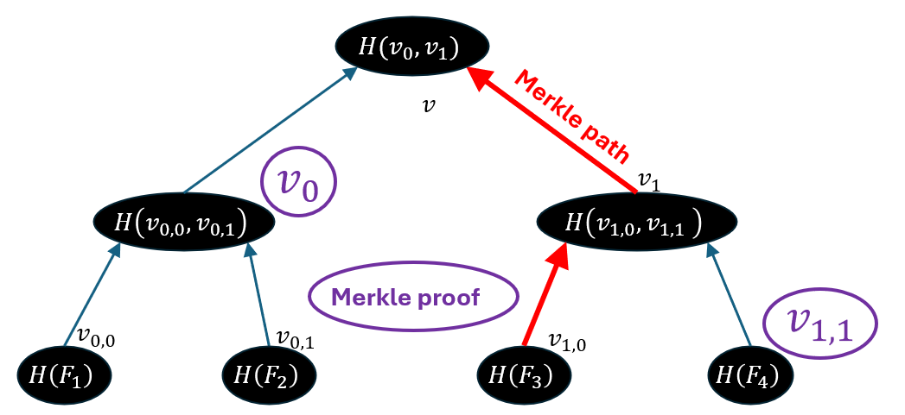
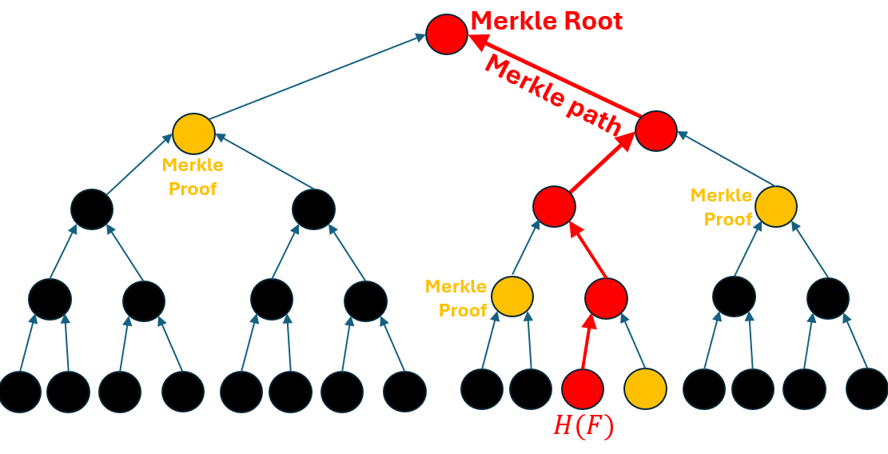

# Merkle Trees

Merkle Trees are a useful application of hashes, that are ubiquitous in cryptocurrencies.

Recall the two useful properties of a hash $$\mathsf{H}$$: it is collision-resistant (which means it is impractical to find two different inputs $$x\ne y$$ such that $$\mathsf{H}(x) = \mathsf{H}(y)$$) and has a fixed output length $$\ell$$.

Imagine the following common scenario: I want to use a remote server to store a large file $$F$$, and erase it from my computer. A year later, I need $$F$$ for something and download it again, how can I be sure that $$F$$ is the same file I stored?

Well, before erasing $$F$$ I can compute and store $$\mathsf{H}(F)$$. Whenever I download a file $$F'$$ that is supposedly a copy of $$F$$, I can verify this by computing $$\mathsf{H}(F')$$ and verifying it is identical to $$\mathsf{H}(F)$$.

Now let us change the question a bit. Instead of having one big file, I have many small files $$F_1,\ldots,F_n$$, what can we do?&#x20;

One way would be to compute and store $$\mathsf{H}(F_1),\ldots,\mathsf{H}(F_n)$$, but this would require us to store $$n$$ hashes, taking $$\ell\cdot n$$ bits! We do not want the storage requirements of our solution to increase linearly with the amount of files.

Another thing we could do is to hash a single concatenation of all files $$H(F_1\|\ldots\|F_n)$$. This will indeed only require $$\ell$$ bits. However, the only way to verify our download is to download _all files_.

Is there a way that on the one hand allows us to verify each file independently, and on the other does not require a lot of storage? Yes there is.

Let us start with four files, $$F_1,F_2,F_3,F_4$$. Why four? You'll see. The first thing we do, is to compute the hashes $$\mathsf{H}(F_1),\ldots,\mathsf{H}(F_4)$$, and place the result as the leafs of a binary tree:

<figure><figcaption></figcaption></figure>

To make things simple, we will mark the value of each node with $$v_w$$ where $$w$$ is a binary string describing the path from the root to that node. For example, for the leftmost leaf we have $$H(F_1) = v_{0,0}$$. With this notation, we can define the value of each node to be the hash of its two children.

<figure><figcaption></figcaption></figure>

The value $$v$$ is called the _Merkle root_, and it is _the only value we store_. That is, no matter how many files we backup, we will always need exactly $$\ell$$ bytes.

Now what if we want to download and verify the file $$F_3$$? The server sends us the file, along with the values $$v_{1,1}$$, and $$v_0$$. That is, the values of all nodes that are _exactly once step away_ from the path from the root to the hash of $$F_3$$. The data $$(v_{1,1},v_0)$$ is called the _Merkle proof_.

<figure><figcaption></figcaption></figure>

&#x20;Why is the proof useful? Note that we know $$F_3$$, so we can compute $$v_{1,0} = \mathsf{H}(F_3)$$. We know $$v_{1,1}$$ from the proof, so we can now compute $$v_1 = \mathsf{H}(v_{1,0},v_{1,1})$$. We know $$v_0$$ from the proof, so we can finally compute $$v=\mathsf{H}(v_0,v_1)$$ and compare it to the Merkle root I stored.

A quick inductive argument shows that if there is a fake Merkle proof for another file $$F$$ that somehow passes this validation, then _somewhere_ along the path we will find a collision in $$\mathsf{H}$$, contradiction collision-resistance.

Note that the size of the Merkle proof is one less than _the height of the tree_. For four files, the size of the Merkle proof is $$2\cdot \ell$$. For more files, the process looks like this.

<figure><figcaption></figcaption></figure>

For $$n$$ files, the size of the Merkle root remains _one_ hash. The size of the proof increases by _one hash_ every time the number of files _doubles_. In other words, the Merkle proof contains $$\log n$$ hashes. Given the file $$F$$, and the Merkle proof, I can easily compute all the hashes along the Merkle path, all the way up to the root.

This cool trick is used in many ways in cryptography and cryptocurrencies. One example is the block _header_. Recall that when we [described how proof-of-work works](../../../part-1-blockchains-and-blockdags/chapter-1-bft-vs.-pow/how-pow-works.md), we said that the block header must contain information that ties it to the contents of the block, without making the header too large. Well, _this is it_. When creating the block, the miner computes a Merkle root of all transactions therein and places it in the block. When given a list of transactions that were allegedly the contents of this block, one could compute the Merkle tree for themselves to verify this.

At this point some of you might be asking: "wait, wasn't the _entire motivation_ to verify files separately? If we just verify the entire block content, why not just hash all of the transactions together?". Ah, nice observation. The motivation for using a Merkle tree is exactly so that a user could prove a transaction was in a given block without having to store and transmit the entire block content. Instead, they only store the Merkle proof of the transaction that interests them. With this proof in hand, the user can verify that the transaction is present in a block with access to nothing but the header. This is the idea of _simple perfect verification_ (SPV) nodes. They only store block headers and discard of block data, but thanks to Merkle proof, users can still verify that their transaction is on the blockchain.
